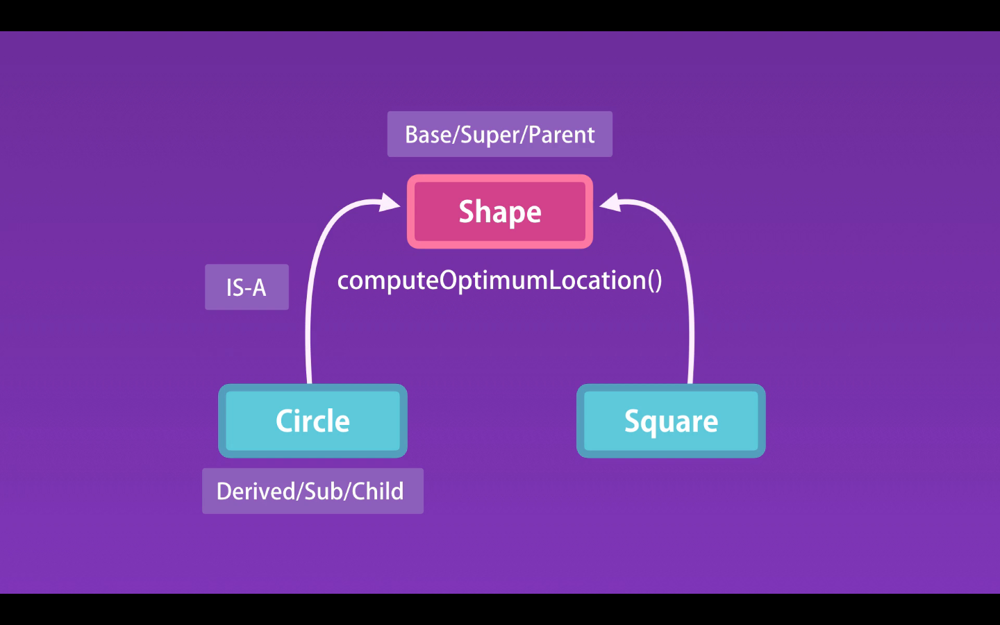

# 01- Inheritance

## Inheritance

Inheritance lets one object acquire the properties and methods of another object, the Parent Object.

If we have properties and method that are common to several Objects, we can define a general Object and theses objects will inherit from the general Object.

Lets image we have a Circle class and a Square class that have a need the same computeOptimumLocation() method.

With Inheritance both the Circle and Square could inherit a computeOptimumLocation() method from the Shape class.

Inheritance terms:

- The Shape class is ---> Base / Super / Parent
- The Circle and Square classes are ---> Derived /Sub / Child
- The inheritance relationship ---> IS-A

## Classical Inheritance vs Prototypical Inheritance

In JavaScript we do not have classes we have objects, thats when Prototypical Inheritance comes into place.
