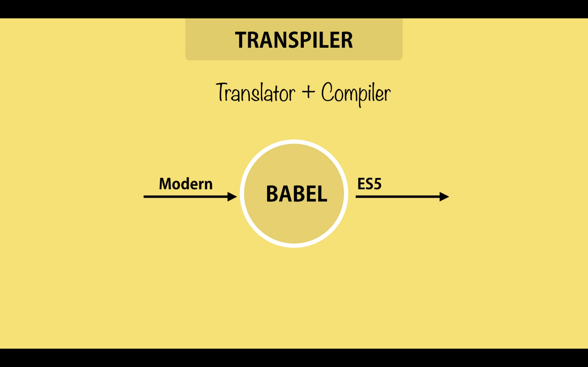
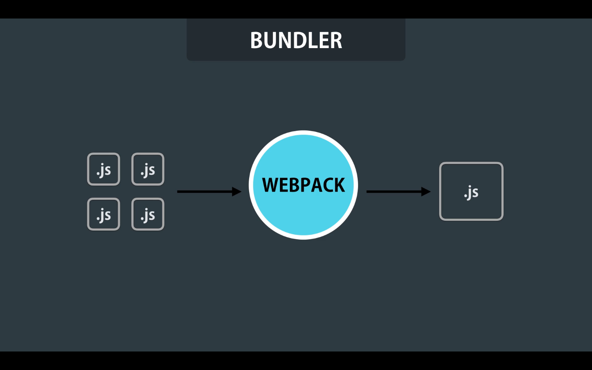

# 04- ES6 Tooling

When using modern JavaScript we need two kinds of tools

## 1. Transpiler

The term Transpiler comes from the combination of two words Translator + Compiler. Basically it is a tool that we give it our modern JavaScript code, and it will convert our code in code that all browsers can understand (ES5).

[**Babel**](https://babeljs.io/) is a popular Transpiler for modern JavaScript.

## 2. Bundler

A module bundler is responsible to combine all our JavaScript files into a single JavaScript file, witch we call a bundle. The most popular module bundler is [**Webpack**](https://webpack.js.org/).

So we give all our files to **Webpack**, it will minify our code, by clearing all comments and whitespace, and then it will uglify by shortening the name of our identifiers, like classes function, and so on. This will reduce the size od the bundle served to the client.

